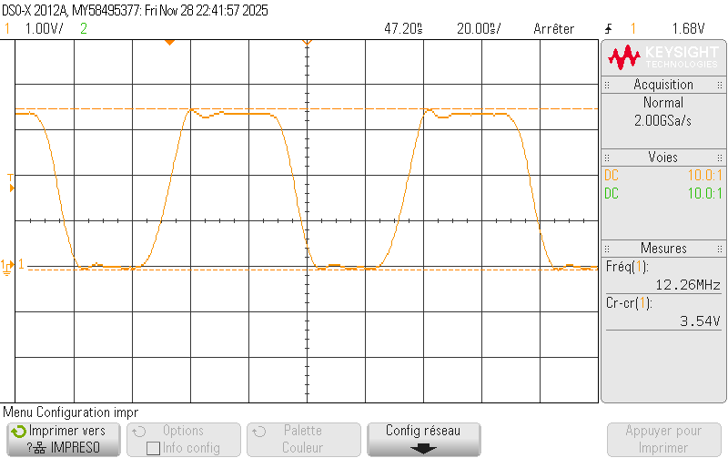
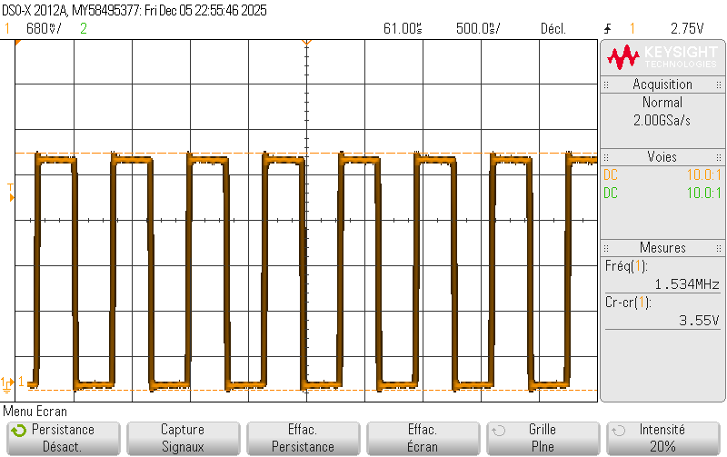
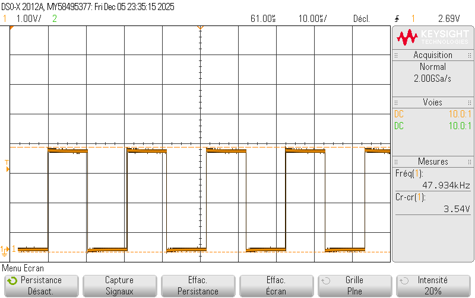
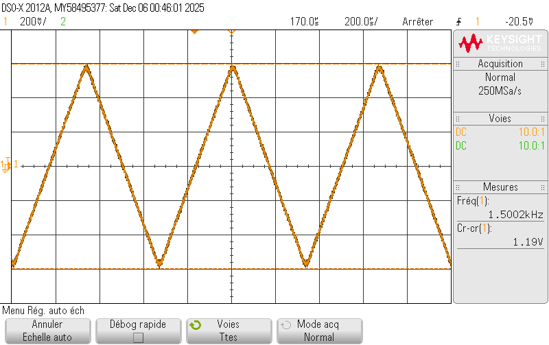
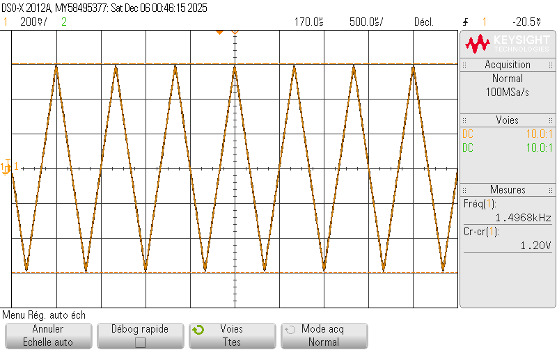

# 🎓 TP de Synthèse — Autoradio

## 👥 Équipe

| Nom | Prénom | Groupe |
|:--|:--|:--:|
| THÉBAULT | [Nelven](https://github.com/NelvTheb) | ESE TP1 |
| CORDI | [Hugo](https://github.com/Lynxlegrand) | ESE TP1 |

🏫 **ENSEA — 3A ESE**  
👨‍🏫 **Encadrants :** [L.Fiack](https://github.com/lfiack)  et  [N.Papazoglou](https://github.com/lfiack)

---

## TOC
- [👥 Équipe](#-équipe)
- [🎯 Objectifs du TP](#-objectifs-du-tp)
- [1. Démarrage](#1-démarrage)
- [2. Le GPIO Expander et le VU-Mètre](#2-le-gpio-expander-et-le-vu-metre)
- [3. Le CODEC Audio SGTL5000](#3-le-codec-audio-sgtl5000)
- [4. Visualisation](#4.-visualtion)
- [5. Filtre RC](#5.-filtre-rc)
- [6. Programmation d'un effet audio](#6.-programmation-d'un-effet-audio)

# 🎯 Objectifs du TP

> **But :** Concevoir et analyser un système d’autoradio analogique simplifié comprenant :
>
> - La réception et la démodulation du signal audio  
> - L’amplification du signal de sortie  
> - La gestion de la commande de volume  
>
> Ce TP vise à mettre en œuvre les compétences acquises en électronique analogique et en traitement du signal.
---

# 1. Démarrage

1. Créez un projet pour la carte NUCLEO_L476RG. Initialisez les périphériques avec leur mode par défaut, mais n’activez pas la BSP.
   - Cible : `NUCLEO-L476RG`
   - Langage : `C`
   - IDE : `STM32CubeIDE`
   - Configuration : périphériques par défaut, **sans activer la BSP**

2. Testez la LED LD2.
   - LED connectée à la broche **PA5**
   - Fonction de test :
     ```c
     HAL_GPIO_TogglePin(GPIOA, GPIO_PIN_5);
     HAL_Delay(200);
     ```
   - ✅ Résultat : LED clignotante confirmant le bon fonctionnement du GPIO.

3. Testez l’USART2 connecté à la STLink interne.
   - Broches : `PA2 (TX)` / `PA3 (RX)`
   - Configuration : 115200 bauds
   - Ajout de la redirection pour le printf
     ```c
        int __io_putchar(int chr)
        {
        HAL_UART_Transmit(&huart2, (uint8_t*)&chr,1,HAL_MAX_DELAY);
        return chr;
        }
     ```
   - Envoi d’un message simple :
     ```c
     printf("==== Autoradio Hugo Nelven ====\r\n");
     ```
   - ✅ Résultat : message reçu correctement dans le terminal série.

4. Débrouillez-vous pour que la fonction printf fonctionne.
   - Middleware activé : **CMSIS v1**
   - Création d’une tâche principale `StartDefaultTask` :
     ```c
     void task_led(void * unused)
      {
         for (;;)
         {
            HAL_GPIO_TogglePin(GPIOA, GPIO_PIN_5);
            vTaskDelay(250);
         }
      }
     ```
   - ✅ Résultat : LED contrôlée par une tâche FreeRTOS (test multitâche réussi).

5. Activez FreeRTOS en mode CMSIS V1.
   - Shell basé sur le projet de référence : [rtos_td_shell](https://github.com/lfiack/rtos_td_shell)
   - Intégration du shell dans une tâche dédiée, avec interruption UART et sémaphores et librairie.
   - ✅ Résultat : commandes interactives fonctionnelles via terminal série.

6. Faites fonctionner le shell :
   - (a) Dans une tâche,
   ```c
   void task_shell(void * unused)
   {
   	shell_init(&h_shell);
   	shell_add(&h_shell, 'f', fonction, "Une fonction inutile");
   	shell_add(&h_shell, 'a', addition, "Ma super addition");
   	shell_run(&h_shell);
   
   	// Une tâche ne doit *JAMAIS* retourner
   	// Ici elle ne retourne pas parce qu'il y a une boucle infinie dans shell_run();
   }
     ```

   - (b) En mode interruption,
   ```c
   void HAL_UART_RxCpltCallback(UART_HandleTypeDef *huart)
   {
   	if (huart->Instance == USART2)	// LPUART1
   	{
   		// Caractère reçu : Donner le sémaphore pour débloquer task_shell
   		shell_uart_rx_callback(&h_shell);
   	}
   }
     ```

   - (c) Avec un driver sous forme de structure.
   ```c
   typedef uint8_t (* drv_shell_transmit_t)(char * pData, uint16_t size);
   typedef uint8_t (* drv_shell_receive_t)(char * pData, uint16_t size);
   
   typedef struct drv_shell_struct
   {
   	drv_shell_transmit_t drv_shell_transmit;
   	drv_shell_receive_t drv_shell_receive;
   } drv_shell_t;
   
   struct h_shell_struct;
   
   typedef int (* shell_func_pointer_t)(struct h_shell_struct * h_shell, int argc, char ** argv);
   
   typedef struct{
   	char c;
   	shell_func_pointer_t func;
   	char * description;
   } shell_func_t;
   
   typedef struct h_shell_struct
   {
   	UART_HandleTypeDef * huart;
   	drv_shell_t drv_shell;
   
   	SemaphoreHandle_t sem_uart_rx;
   	int shell_func_list_size;
   	shell_func_t shell_func_list[SHELL_FUNC_LIST_MAX_SIZE];
   
   	char print_buffer[BUFFER_SIZE];
   	char cmd_buffer[BUFFER_SIZE];
   } h_shell_t;

     ```

Remarque : Vous pouvez vous aider des codes disponibles sur ce projet github :  
https://github.com/lfiack/rtos_td_shell

---

# 2. Le GPIO Expander et le VU-Metre

## 2.1 Configuration

1. Quelle est la référence du GPIO Expander ? Vous aurez besoin de sa datasheet, téléchargez-la.

La référence du GPIO_Expander est *MCP23S17*. 

2. Sur le STM32, quel SPI est utilisé ?

*SPI3* est utilisé car les SCK/MISO/MOSI/CS sont sur PC10/PC11/PB5/PB7. 

3. Quels sont les paramètres à configurer dans STM32CubeIDE ?


Pour activer le SPI, il faut se rendre dans l'ioc et activer les SCK/MISO/MOSI/CS qui sont sur PC10/PC11/PB5/PB7. De plus, il faut mettre Data size à 8 bits et le PSC à 32 pour réduire la vitesse de transmission des données. Ne pas oublier de mettre le PA0 en GPIO_OUT pour le CS à l'initialisation.


4. Configurez-les.

On a commencé à coder le driver du GPIO_Expander

## 2.2 Tests

1. Faites clignoter une ou plusieurs LED.

2. Pour toutes les tester, vous pouvez faire un chenillard (par exemple).
   ```c
      void task_chenillard(void *unused)
   {
   	    uint8_t led_state = 0x01;
   	    for (;;)
   	    {
   	        // Allume la LED correspondante sur MCP23S17 port A
   	    	MCP23S17_WriteRegister(0x12, led_state);
   
   	        // Décale la LED à allumer
   	        led_state <<= 1;
   	        if (led_state == 0) {
   	            led_state = 0x01;  // Reset au début du chenillard
   	        }
   
   	        vTaskDelay(pdMS_TO_TICKS(200));  // délai 200 ms
   
   
   	    }
   }
   ```
   On observe bine que chaque LEDs sont allumés et une seule s'éteint, chacun à sont tour pendant 200ms, puis se rallume -> effet de défilement.

## 2.3 Driver

1. Écrivez un driver pour piloter les LED. Utilisez une structure.

   - Fait, voir le driveur dans `chenille.h` et `chenille.c`

3. Écrivez une fonction shell permettant d’allumer ou d’éteindre n’importe quelle LED.
   - Création de la fonction puis ne pas oublier de l'ajouter au shell avec
     ```c
      shell_add(&h_shell, 'l', led_control, "LED control: l <id[0:16]> <0|1>");
     ```
   - Code de la fonction
     ```c
      int led_control(h_shell_t *h_shell, int argc, char **argv)
      {
      	int numero;
      	int size;
      	numero = atoi(argv[1]);
      	if (argc==3)
      	{
      		if ((numero > 8) && (numero < 17)){
      			if (numero > 8)
      			{
      				Select_LED('B', 16-numero,atoi(argv[2]));
      			}
      			else if (numero < 8)
      			{
      				int state = atoi(argv[2]);
      				Select_LED('A', numero,state);
      			}
      			else {
      				size = snprintf(h_shell->print_buffer,BUFFER_SIZE,"[N>16] ! Il y a pas assez de led\r\n");
      			}
      			size = snprintf(h_shell->print_buffer,BUFFER_SIZE,"LED OK\r\n");
      			}
      		else{
      			size = snprintf(h_shell->print_buffer,BUFFER_SIZE,"[N>16] ! Il y a pas assez de led\r\n");
      		}
      	}
      	else if (argc==4)
      	{
      		numero = atoi(argv[1]) * 10 + atoi(argv[2]);
      		if (numero < 17){
      		Select_LED('B', 16-numero,atoi(argv[3]));
      		size = snprintf(h_shell->print_buffer,BUFFER_SIZE,"LED OK\r\n");
      		}
      		else{
      			size = snprintf(h_shell->print_buffer,BUFFER_SIZE,"[N>16] ! Il y a pas assez de led\r\n");
      		}
      	}
      	else
      	{
      		size = snprintf(h_shell->print_buffer,BUFFER_SIZE,"Écrire : l <id[0:16]> <0|1>\r\n");
      	}
      	drv_uart_transmit(h_shell->print_buffer,size);
      	return 0;
      }
     ```
---

# 3. Le CODEC Audio SGTL5000

## 3.1 Configuration préalables

Le CODEC a besoin de deux protocoles de communication : 

- L’`I2C` pour la configuration,  
- L’`I2S` pour le transfert des échantillons audio.  

Les configurations suivantes sont à faire sur le logiciel STM32CubeIDE dans la partie graphique CubeMX. Le protocole `I2S` est géré par le périphérique SAI (Serial Audio Interface).

1. Quelles pins sont utilisées pour l’`I2C` ? À quel `I2C` cela correspond dans le STM32 ?

Les pins utilisées pour l'`I2C` sont `PB10` pour `I2C2_SCL` et `PB11` pour `I2C2_SDA`. Cette configuration correspond donc à l'`I2C2`. 

2. Activez l’`I2C` correspondant, laissez la configuration par défaut.

On active l'`I2C2_SDA`. 

3. Configurez le SAI2 :
   - `SAI A` : Master with Master Clock Out,
   - Cochez I2S/PCM protocol,
   - `SAI B` : Synchronous Slave,
   - Cochez I2S/PCM protocol.

4. Si nécessaire, déplacez les signaux sur les bonnes broches. Vous pouvez déplacer une broche avec un [Ctrl+Clic Gauche]. Les signaux du SAI doivent être connectés au broches suivantes :
   - `PB12` : `SAI2_FS_A`
   - `PB13` : `SAI2_SCK_A`
   - `PB14` : `SAI2_MCLK_A`
   - `PB15` : `SAI2_SD_A`
   - `PC12` : `SAI2_SD_B`

5. Dans l’onglet Clock Configuration, configurez `PLLSAI1` pour obtenir la fréquence To `SAI2` à 12.235294 MHz.

6. Configurez les blocs `SAI A` et `SAI B` de la manière suivante :

7. Activez les interruptions.

8. Configurez le DMA pour le `SAI A` et le `SAI B`. Activez le mode circulaire.

9. Avant de passer à la suite, il est nécessaire d’activer l’horloge `MCLK` pour que le CODEC fonctionne. Pour cela, dans la fonction `main()`, après les initialisations, on ajoute la ligne suivante :
```c
__HAL_SAI_ENABLE(&hsai_BlockA2);
```
> [!CAUTION]
> Sans cette ligne, l’I2C ne fonctionne pas, parce que le CODEC ne reçoit pas d’horloge !

## 3.2 Configuration du CODEC par l’I2C

1. À l’aide d’un oscilloscope, vérifiez la présence d’une horloge sur le signal MCLK :



- On remarque la fréquenc modulo le degré de précision de l'oscilloscope :

$$\boxed{f_{MCLK}=12.26\text{ MHz}\simeq12.235294\text{ MHz}}$$

2. À l’aide de la fonction `HAL_I2C_Mem_Read()`, récupérez la valeur du registre `CHIP_ID` (addresse `0x0000`). L’adresse `I2C` du CODEC est `0x14`.

```c
/* USER CODE BEGIN Private defines */
#define CODEC_I2C_ADDR  0x14


// REGISTRES
#define CODEC_REG_CHIP_ID 0x0000
/* USER CODE END Private defines */


void task_i2c_update(void *unused)
{
    uint8_t id = 0;
    HAL_StatusTypeDef ret;
	for (;;)
	{
	    ret = HAL_I2C_Mem_Read(&hi2c2, (uint16_t)(CODEC_I2C_ADDR), (uint16_t)CODEC_REG_CHIP_ID, (uint16_t)I2C_MEMADD_SIZE_8BIT, &id, (uint16_t)sizeof(id), HAL_MAX_DELAY);

	    if (ret != HAL_OK){
	    	printf("error i2c read init\r\n");
	    	Error_Handler();
	    }

//	    vTaskDelay(pdMS_TO_TICKS(100));
	}
}
```
- On récupère la valeur `0xA0` ➡ 160

3. Observez les trames `I2C` à l’oscilloscope.


On fait volontairement du pooling pour observer plus facilement les trames I2C. Dans la suite du TP, il faut décommenter "vTaskDelay" pour que les autres tâches puissent se lancer. 

5. On Cherche dans la documentation du `SGTL5000` la valeur à assigner aux
registres suivants, ce qu'on ne trouve pas dans notre context précis donc on s'est basé sur [driver-sgtl5000
](https://github.com/hi-squeaky-things/driver-sgtl5000/tree/main).
6. Créez une paire de fichier sgtl5000.c / sgtl5000.h
7. Dans le fichier sgtl5000.c, créez une fonction d’initialisation.
8. Dans cette fonction, écrivez le code permettant de configurer ces registres :

> [!IMPORTANT]
> sgtl5000.h
```c
// ===================== REGISTRES MAX98357 / CODEC ======================

// LINREG CTRL
#define REG_LINREG_CTRL_ADDR      0x0026
#define REG_LINREG_CTRL_VALUE     0x0060   // 0b0000'0000'0110'0000
// Explication : Active la régulation interne nécessaire à l’alimentation analogique.

// ANA POWER
#define REG_ANA_POWER_ADDR        0x0030
#define REG_ANA_POWER_VALUE       0x00BB   // 0b0000'0000'1011'1011
// Explication : Active les blocs analogiques nécessaires (LDO, drivers, DAC analogique).

// DIG POWER
#define REG_DIG_POWER_ADDR        0x0002
#define REG_DIG_POWER_VALUE       0x0063   // 0b0000'0000'0110'0011
// Bits :
// 6 = ADC_POWERUP       = 0 → ADC OFF
// 5 = DAC_POWERUP       = 1 → DAC ON
// 4 = DAP_POWERUP       = 1 → DAP ON
// 1 = I2S_OUT_POWERUP   = 1 → I2S OUT ON
// 0 = I2S_IN_POWERUP    = 1 → I2S IN ON
// Explication : Active DAC + DAP + I2S IN/OUT pour un flux audio complet.

// CLK CTRL
#define REG_CLK_CTRL_ADDR         0x0004
#define REG_CLK_CTRL_VALUE        0x0004   // 0b0000'0000'0000'0100
// Explication : Configuration de l’horloge digitale (MCLK, BCLK...).

// I2S CTRL
#define REG_I2S_CTRL_ADDR         0x0006
#define REG_I2S_CTRL_VALUE        0x0030   // 0b0000'0000'0011'0000
// Explication : Mode I2S standard, 16/24/32 bits selon datasheet.

// SSS CTRL
#define REG_SSS_CTRL_ADDR         0x000A
#define REG_SSS_CTRL_VALUE        0x0011   // 0b0000'0000'0001'0001
// Explication : Route l’audio I2S vers le DAC.

// ADCDAC CTRL
#define REG_ADCDAC_CTRL_ADDR      0x000E
#define REG_ADCDAC_CTRL_VALUE     0x0090   // 0b0000'0000'1001'0000
// Explication : Unmute du DAC.

// DAC VOLUME
#define REG_DAC_VOL_ADDR          0x0010
#define REG_DAC_VOL_VALUE         0x3C3C   // 0b0011'1100'0011'1100
// Explication : Volume DAC = 0 dB (gain neutre)
```

> [!IMPORTANT]
> sgtl5000.c, on a récupéré le fichier de config sur le moodle

## 3.3 Signaux I2S
1. Démarrez la réception et la transmission sur l’I2S avec le SAI :
```c
HAL_StatusTypeDef HAL_SAI_Receive_DMA(SAI_HandleTypeDef *hsai, uint8_t *pData, uint16_t Size)
HAL_StatusTypeDef HAL_SAI_Transmit_DMA(SAI_HandleTypeDef *hsai, uint8_t *pData, uint16_t Size)
```
Ce code est implémenté directement dans le `sgtl5000.c`.

2. Observez à l’oscilloscope les différents signaux d’horloge.

On observe la même `MCLK` que précédement et aussi `SCLK` :



Et `LRCLK` à $48$ kHz



## 3.4 Génération de signal audio

1. Génération du signal triangulaire

```c
// Code
```

2. On observe bien un signal triangulaire :





## 3.5 Bypass numérique

# 4. Visualisation

# 5. Filtre RC

# 6. Programmation d'un effet audio


